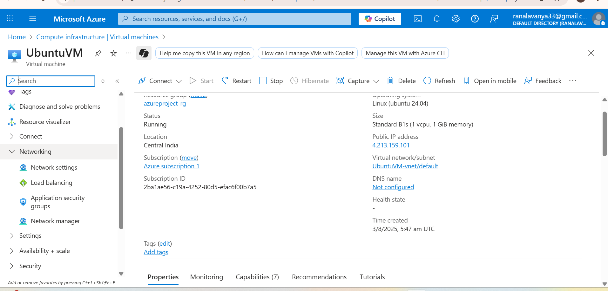
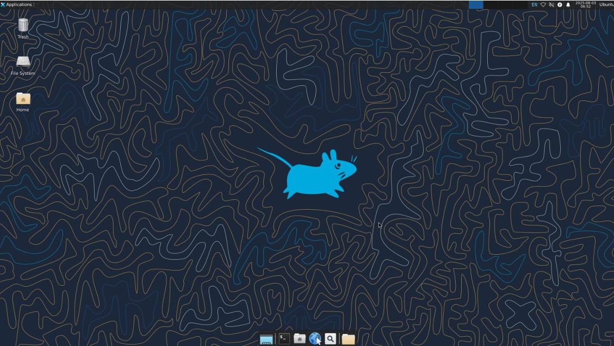
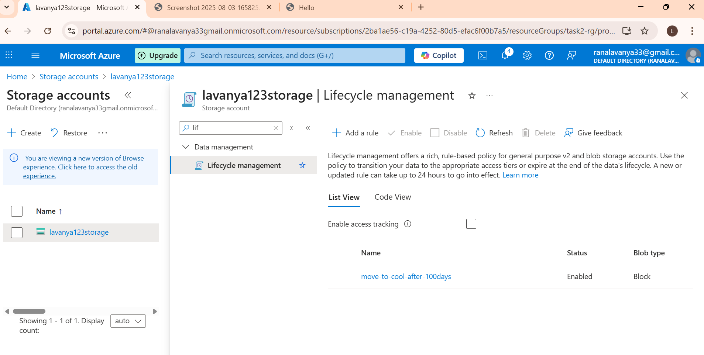
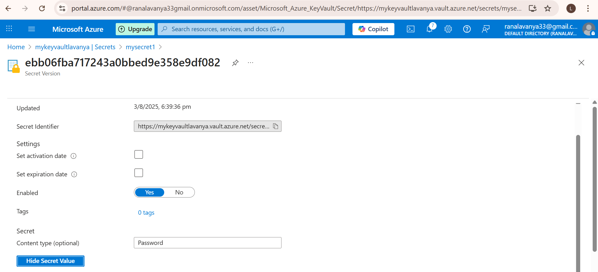
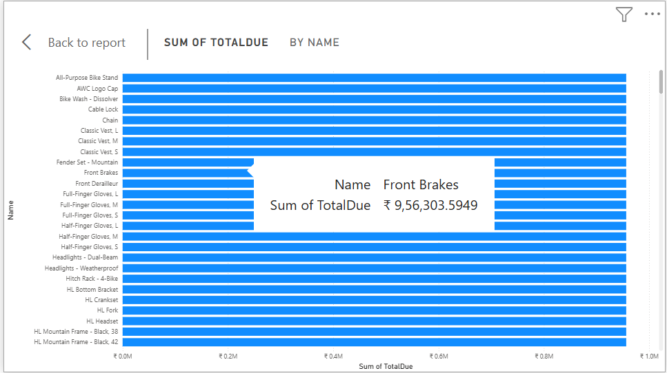

# Azure Cloud Infrastructure & Data Analytics Project

## Project Overview

This project demonstrates hands-on implementation of core Microsoft Azure cloud services including Virtual Machine deployment, Blob Storage management, Key Vault security configuration, and Power BI data visualization.

All resources were deployed using Azure free-tier services as part of a Cloud Computing internship assignment.

---

## Project Architecture

The project follows a simple cloud-based workflow:

- Azure Virtual Machine (Linux Ubuntu) for compute access
- Azure Blob Storage for unstructured file storage
- Azure Key Vault for secure secret management
- Azure SQL Database for structured data
- Power BI for analytics and visualization

---

## Task 1: Azure Virtual Machine

- Created Ubuntu Linux VM (B1s free tier)
- Configured SSH authentication using public key
- Connected via local terminal
- Verified login (azureuser@ubuntuvm)
- Stopped VM after usage to avoid charges

### Screenshots

---

## Task 2: Azure Blob Storage

- Created Storage Account
- Created Blob Container
- Uploaded image file
- Maintained private access level

### Screenshots

---

## Task 3: Azure Key Vault

- Created Azure Key Vault
- Assigned secret permissions
- Created and stored a secret
- Verified secret in Azure Portal

### Screenshot

---

## Task 4: Azure SQL & Power BI

- Created Azure SQL Database (AdventureWorksLT sample)
- Configured firewall to allow IP access
- Connected SQL Database to Power BI Desktop
- Loaded tables: Product, Customer, SalesOrderHeader
- Built visualizations:
  - Bar Chart (Sales Analysis)
  - Pie Chart (Customer Distribution)
  - Table View (Order Data)

### Screenshots

---

## Security Implementation

- SSH key-based authentication used for VM
- Blob Storage access level maintained as private
- Azure Key Vault used for secret management
- Firewall rules configured for database access

---

## Key Learnings

- Understanding of IaaS vs PaaS in Azure
- Secure cloud configuration practices
- Storage account and blob container management
- SQL database connectivity and firewall setup
- Data visualization using Power BI
- End-to-end cloud service integration

---

## Author

Lavanya Rana  
Cloud Computing Intern
YHills Edutech Pvt.Ltd(june 2025-july 2025)
